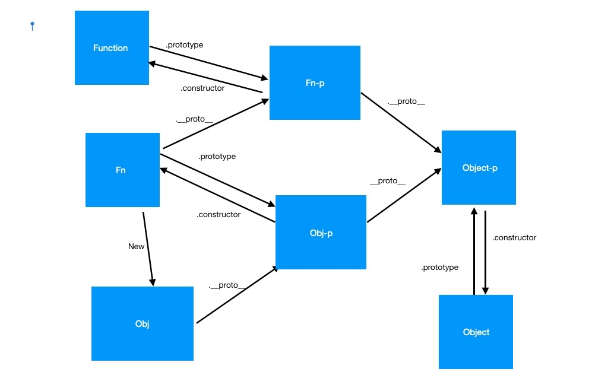

# 函数的实例化=>组件的闭标签

## 函数与函数的实例化对象
//什么是函数  与对象的关系
//函数、实例、原型


```js
    function f(){
        this.a = 1;
    }
    const obj = new f();
    //obj
    //原型链与对象的原型
    const objP = obj.__proto__;// 关于__proto__
    //objP
    //总结 
```


### 函数的本质？ 角色：类与原型


### dom的本质=>dom标签与dom对象


### 小程序||Vue的组件与闭标签  
```js
    //wx小程序
    Component({
        options: {
        multipleSlots: true // 在组件定义时的选项中启用多slot支持
        },
        properties: { /* ... */ },
        methods: { /* ... */ }
    })

```


## class
```js
    class a{}   
    typeof a    // "function" 
    a instaceof Function  // true   why?=>关于 typeof 与 instanceof
```
// constructor 
// 父类与子类
## react组件与组件的闭标签
```js
    //函数式组件
    function A(props){
        return <div>我是函数式组件A</div>
    }
    //使用方式：   <A />  或者 <A></A>
    
    //类组件 
    class B extends React.Component{
        render(){
            return <div>我是类组件B</div>
        }
    }
    //使用方式：  <B /> 或者  <B></B>
```

### 组件的闭标签
//to 1-0.demo.js
```js
    function A (){
        return <div>我是组件A</div>
    }

    function B(){
        return (
            <div>
                <A />
            </div>
        )
    }
```