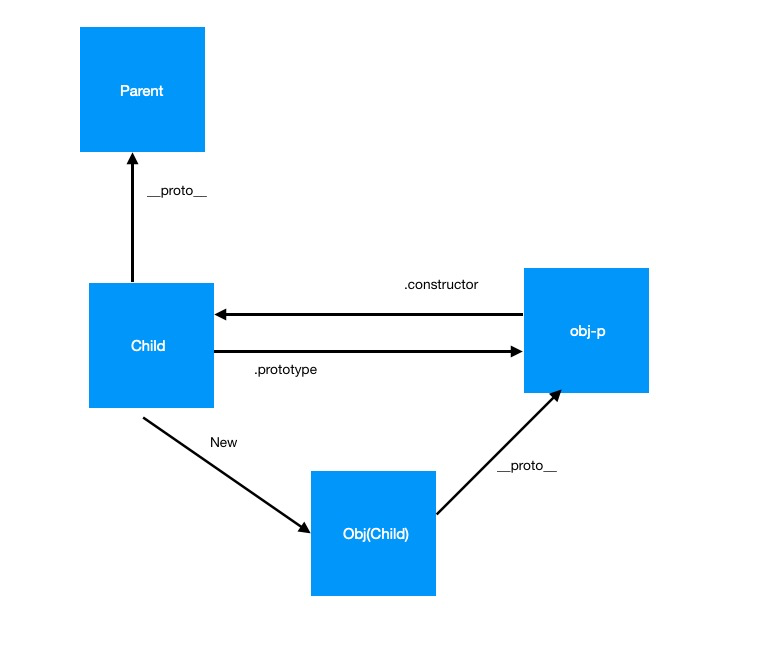

# 类与生命周期的实现

## es6中的类
```js
    class a{}
    new a(); //new ? 
```
// 实例属性(方法)的绑定
// 类的继承 extends 
```js
    class Parent{
        a=1;
    }
    class Child extends Parent{
        b=2;
    }
    new Child()
    //extends做了什么
    //new做了什么=>对象属性的覆盖
```



### 生命周期的实现
```js
    class Component {
        constructor(props){
            console.log(this.componentDidRender);
            setTimeout(()=>{
                this.componentWillRender();
                this.render();
                this.componentDidRender();
            })
        }
        state=1;
        componentWillRender=()=>{
            console.log('componentWillRender')
        }
        render=()=>{
            console.log('render');
        }
        componentDidRender=()=>{
            console.log('componentDidRender')
        }
    }
    // new Component();
    class Child extends Component{
        constructor(){
            super();
            this.num = 10;
        }
        state =2;
        componentDidRender=()=>{
            console.log('可以改写方法')
        }
    }
    new Child();
```


